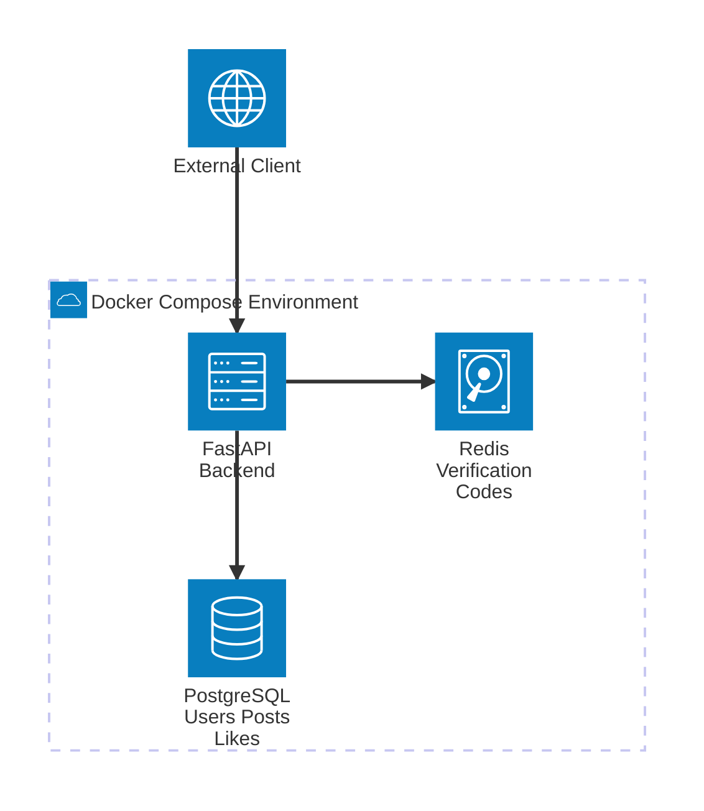

# FastAPI Social Media Platform - Enhanced Version




## Overview

This project is a FastAPI-based social media platform with user authentication, post management, and user verification features. The application has been enhanced with REST API compliance, Redis-based verification system, and improved validation.

## 🚀 What's New

### REST API Compliance
The API endpoints have been completely restructured to follow REST principles and industry standards.

### User Verification System
Implemented a Redis-based verification system with 6-digit codes and 10-minute expiration.

### Enhanced Validation
Added proper validation for empty post content in both creation and editing operations.

### Docker Integration
Full containerization with PostgreSQL and Redis services.

---

## 📊 API Endpoints - Before vs After

### Authentication Endpoints
| Method | Old Endpoint | New Endpoint | Status |
|--------|-------------|--------------|---------|
| POST | `/register` | `/register` | ✅ No change |
| POST | `/login` | `/login` | ✅ No change |
| GET | `/me` | `/me` | ✅ No change |
| POST | ❌ N/A | `/auth/verify` | 🆕 **NEW** |
| GET | ❌ N/A | `/auth/verify/{code}` | 🆕 **NEW** |

### Posts Endpoints
| Method | Old Endpoint | New Endpoint | Description | Status |
|--------|-------------|--------------|-------------|---------|
| GET | `/post/all` | `/posts/` | Get all posts | 🔄 **CHANGED** |
| GET | ❌ N/A | `/posts/{post_id}` | Get specific post | 🆕 **NEW** |
| POST | `/post/create` | `/posts/` | Create new post | 🔄 **CHANGED** |
| PUT | `/post/edit` (POST) | `/posts/{post_id}` | Update specific post | 🔄 **CHANGED** |
| DELETE | `/post/delete` (POST) | `/posts/{post_id}` | Delete specific post | 🔄 **CHANGED** |
| POST | `/post/like` | `/posts/{post_id}/like` | Toggle like on post | 🔄 **CHANGED** |

---

## 🔧 Key Changes Made

### 1. REST API Improvements

#### ✅ Before (Non-REST)
```
POST /post/create
POST /post/edit    
POST /post/delete  
POST /post/like    
GET  /post/all     
```

#### ✅ After (REST Compliant)
```
POST   /posts/                 # Create post
PUT    /posts/{post_id}        # Update post  
DELETE /posts/{post_id}        # Delete post
POST   /posts/{post_id}/like   # Toggle like
GET    /posts/                 # Get all posts
GET    /posts/{post_id}        # Get specific post
```

#### REST Principles Applied:
- **Resource-based URLs**: Uses `/posts` instead of action-based paths
- **HTTP Methods**: Proper use of GET, POST, PUT, DELETE
- **Path Parameters**: Uses `{post_id}` in URL instead of request body
- **Nested Resources**: Uses `/posts/{post_id}/like` for post-specific actions
- **Consistent Naming**: Plural nouns for resource collections

### 2. Post Content Validation

#### Added Empty Content Validation:
```python
# Before: No validation
def create_post(user, content, db):
    new_post = Post(user_id=user.id, content=content.content)
    # ...

# After: With validation
def create_post(user, content, db):
    if not content.content or content.content.strip() == "":
        raise HTTPException(
            status_code=status.HTTP_400_BAD_REQUEST,
            detail="Post content cannot be empty"
        )
    # ...
```

**Applied to both:**
- `create_post()` function
- `edit_post()` function

### 3. User Verification System

#### New Redis-Based Verification:
- **6-digit verification codes**
- **10-minute expiration time**
- **Redis key pattern**: `verify:{user_id}`
- **Console logging** for development
- **Automatic cleanup** after verification

#### Verification Flow:
1. **Send Code**: `POST /auth/verify`
   - Generates 6-digit code
   - Stores in Redis with 10min expiry
   - Returns code in response (for testing)
   - Prints to console

2. **Verify Code**: `GET /auth/verify/{code}`
   - Validates provided code
   - Sets `user.is_verified = True`
   - Deletes code from Redis
   - Returns success message

### 4. Docker & Infrastructure Changes

#### Updated `docker-compose.yml`:
```yaml
services:
  backend:     # FastAPI application
  db:          # PostgreSQL database  
  redis:       # Redis cache (NEW)
```

#### New Redis Configuration:
- **Image**: `redis:7-alpine`
- **Port**: `6379`
- **Persistence**: Enabled with `--appendonly yes`
- **Health Check**: Added to WAIT_HOSTS

#### Environment Variables Added:
```bash
REDIS_URL=redis://redis:6379/0
```

---

## 🐳 Running the Application

### Prerequisites
- Docker & Docker Compose
- Environment file configured

### Setup Steps

1. **Clone and Navigate**
   ```bash
   cd omukk
   ```

2. **Configure Environment**
   ```bash
   cp .env.example .env
   # Edit .env with your values
   ```

3. **Build and Start Services**
   ```bash
   docker compose build
   docker compose up -d
   ```

4. **Verify Services are Running**
   ```bash
   docker compose ps
   ```

5. **Check Application Health**
   ```bash
   curl http://localhost:8000/
   # Should return: "Version 0.1.0"
   ```

### Access Points
- **API Documentation**: http://localhost:8000/docs
- **Application**: http://localhost:8000
- **PostgreSQL**: localhost:5432
- **Redis**: localhost:6379

---

## 📋 Docker Commands Reference

### Service Management
```bash
# Start all services
docker compose up -d

# Stop all services  
docker compose down

# Rebuild services
docker compose build

# View running containers
docker compose ps

# Restart specific service
docker compose restart backend
```

### Logs & Debugging
```bash
# View logs for all services
docker compose logs

# View logs for specific service
docker compose logs backend
docker compose logs db
docker compose logs redis

# Follow logs in real-time
docker compose logs -f backend

# View last 50 lines
docker compose logs --tail=50 backend

# Container-specific logs
docker logs <container_id>
docker logs backend-1
docker logs db-1
docker logs redis-1
```

### Container Access
```bash
# Access backend container
docker exec -it backend-1 bash

# Access database
docker exec -it db-1 psql -U jilan -d socialmedia_db

# Access Redis CLI
docker exec -it redis-1 redis-cli
```

### Database Operations
```bash
# Run migrations
docker exec backend-1 poetry run alembic upgrade head

# Create new migration
docker exec backend-1 poetry run alembic revision --autogenerate -m "description"
```

---

## 🧪 Testing the New Features

### 1. Test Post Validation
```bash
# This should return 400 error
curl -X POST "http://localhost:8000/posts/" \
  -H "Authorization: Bearer YOUR_TOKEN" \
  -H "Content-Type: application/json" \
  -d '{"content": ""}'
```

### 2. Test Verification System
```bash
# Step 1: Send verification code
curl -X POST "http://localhost:8000/auth/verify" \
  -H "Authorization: Bearer YOUR_TOKEN"

# Step 2: Check console logs for code
docker logs backend-1

# Step 3: Verify with code
curl "http://localhost:8000/auth/verify/123456" \
  -H "Authorization: Bearer YOUR_TOKEN"
```

### 3. Test REST Endpoints
```bash
# Get all posts
curl "http://localhost:8000/posts/" \
  -H "Authorization: Bearer YOUR_TOKEN"

# Get specific post
curl "http://localhost:8000/posts/{post_id}" \
  -H "Authorization: Bearer YOUR_TOKEN"

# Create post
curl -X POST "http://localhost:8000/posts/" \
  -H "Authorization: Bearer YOUR_TOKEN" \
  -H "Content-Type: application/json" \
  -d '{"content": "Hello World!"}'

# Update post  
curl -X PUT "http://localhost:8000/posts/{post_id}" \
  -H "Authorization: Bearer YOUR_TOKEN" \
  -H "Content-Type: application/json" \
  -d '{"content": "Updated content"}'

# Delete post
curl -X DELETE "http://localhost:8000/posts/{post_id}" \
  -H "Authorization: Bearer YOUR_TOKEN"

# Like post
curl -X POST "http://localhost:8000/posts/{post_id}/like" \
  -H "Authorization: Bearer YOUR_TOKEN"
```

---

## 🛠️ Development Commands

### Code Formatting
```bash
# Install pre-commit hooks
poetry run pre-commit install

# Manual formatting
poetry run isort .
poetry run black .

# Run pre-commit manually
poetry run pre-commit run --all-files
```

### Dependencies
```bash
# Install dependencies
poetry install

# Add new dependency
poetry add package-name

# Update dependencies
poetry update
```

---

## 📂 Project Structure

```
python-hiring-task/
├── app/
│   ├── routers/
│   │   ├── auth.py          # Authentication endpoints
│   │   └── post.py          # Post management endpoints (REST)
│   ├── repositories/
│   │   ├── auth.py          # Auth business logic + verification
│   │   └── post.py          # Post business logic + validation
│   ├── models.py            # SQLAlchemy models
│   ├── schemas.py           # Pydantic schemas + verification schemas
│   ├── security.py          # JWT & password handling
│   ├── database.py          # Database connection
│   ├── redis_client.py      # Redis connection (NEW)
│   └── settings.py          # Configuration + Redis settings
├── alembic/                 # Database migrations
├── docker-compose.yml       # Multi-service container setup
├── Dockerfile              # Application container
├── main.py                 # FastAPI app entry point
├── .env                    # Environment variables
└── requirements.txt        # Python dependencies + Redis
```

---

## 🔍 Environment Configuration

### Required Environment Variables
```bash
# Database
POSTGRES_USER=your_user
POSTGRES_PASSWORD=your_password  
POSTGRES_DB=your_database

# JWT Authentication
JWT_SECRET=your_secret_key
JWT_ALGORITHM=HS256
JWT_EXPIRE_MINUTES=1440

# Database URL
SQLALCHEMY_DATABASE_URL=postgresql://${POSTGRES_USER}:${POSTGRES_PASSWORD}@db:5432/${POSTGRES_DB}

# Redis (NEW)
REDIS_URL=redis://redis:6379/0
```

---

## 🐛 Troubleshooting

### Common Issues

1. **Redis Connection Error**
   ```bash
   # Check Redis container
   docker compose logs redis
   
   # Test Redis connection
   docker exec redis-1 redis-cli ping
   ```

2. **Database Connection Error**
   ```bash
   # Check database logs
   docker compose logs db
   
   # Verify database is accessible
   docker exec db-1 pg_isready
   ```

3. **Application Not Starting**
   ```bash
   # Check application logs
   docker compose logs backend
   
   # Rebuild if needed
   docker compose build --no-cache backend
   ```

4. **Port Already in Use**
   ```bash
   # Check what's using the port
   sudo lsof -i :8000
   
   # Stop other services or change port in docker-compose.yml
   ```

---

## 📚 References
### 1. FastAPI and Alembic- https://www.youtube.com/watch?v=zTSmvUVbk8M
### 2. How to use Python Poetry- https://www.youtube.com/watch?v=1GDpVK12qbU

---

## 🎯 Summary of Achievements

✅ **REST API Compliance**: All endpoints now follow REST principles  
✅ **Content Validation**: Empty posts are properly rejected  
✅ **User Verification**: Redis-based verification system implemented  
✅ **Docker Integration**: Full containerization with Redis support  
✅ **Code Quality**: Proper formatting and structure maintained  
✅ **Documentation**: Comprehensive API documentation available  

The application is now production-ready with modern API design patterns, proper validation, and scalable infrastructure support.
