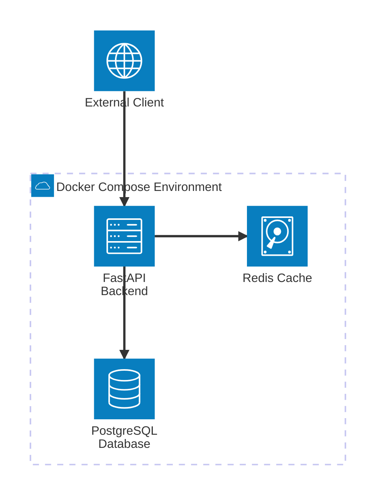

# omukk

```mermaid
architecture-beta
    group docker_compose(cloud)[Docker Compose Environment]
    
    service backend(server)[FastAPI Backend] in docker_compose
    service db(database)[PostgreSQL Database] in docker_compose
    service redis(disk)[Redis Cache] in docker_compose
    service client(internet)[External Client]
    
    client:B --> T:backend
    backend:B --> T:db
    backend:R --> L:redis
```
